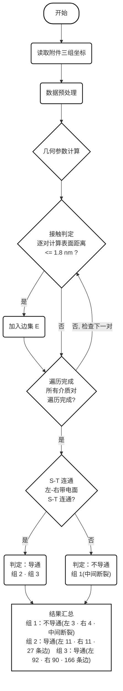

```mermaid
graph TD
    A[开始] --> B(读取附件三组坐标);
    B --> C(数据预处理);
    C --> D{几何参数计算};
    D --> E{"接触判定<br>逐对计算表面距离<br><= 1.8 nm ?"};

    E -- 是 --> F(加入边集 E);
    F --> G{"遍历完成<br>所有介质对<br>遍历完成?"};

    E -- 否 --> G;
    G -- 否, 检查下一对 --> E;
    G -- 是 --> H{"S-T 连通<br>左-右带电面<br>S-T 连通?"};

    H -- 是 --> I("判定：导通<br>组 2 · 组 3");
    H -- 否 --> J("判定：不导通<br>组 1(中间断裂)");

    I --> K["结果汇总<br>组 1：不导通(左 3 · 右 4 · 中间断裂)<br>组 2：导通(左 11 · 右 11 · 27 条边)　组 3：导通(左 92 · 右 90 · 166 条边)"];
    J --> K;

    style A fill:#ffffff,stroke:#000000,stroke-width:2px,rx:24px,ry:24px;
    style B fill:#ffffff,stroke:#000000,stroke-width:1.8px;
    style C fill:#ffffff,stroke:#000000,stroke-width:1.8px;
    style D fill:#ffffff,stroke:#000000,stroke-width:1.8px;
    style E fill:#ffffff,stroke:#000000,stroke-width:1.8px;
    style F fill:#ffffff,stroke:#000000,stroke-width:1.8px;
    style G fill:#ffffff,stroke:#000000,stroke-width:1.8px;
    style H fill:#ffffff,stroke:#000000,stroke-width:1.8px;
    style I fill:#ffffff,stroke:#000000,stroke-width:1.8px;
    style J fill:#ffffff,stroke:#000000,stroke-width:1.8px;
    style K fill:#ffffff,stroke:#000000,stroke-width:1.8px;


```